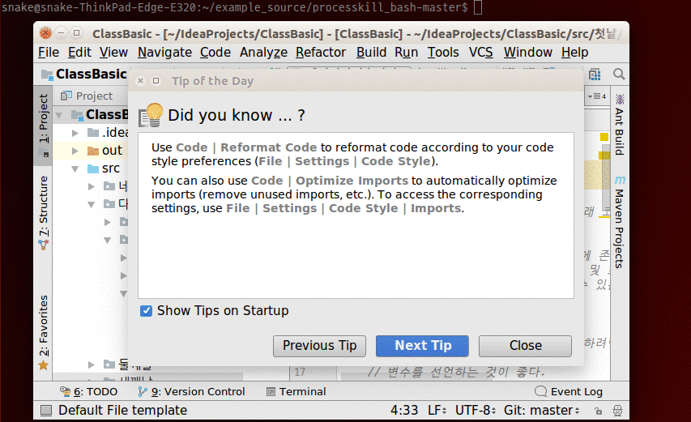

# processkill_bash

우분투에서 process kill을 위한 간단한 script

~~~bash
#!/bin/bash
print_msg()
{
    colors=("\e[1;32;40m$1\033[0m" "\e[1;32;45m$1\033[0m" "\e[1;34;48m$1\033[0m")
    echo -e ${colors[$2]}
}

# parameter 채크하기
if [ $# -lt 1 ]; then echo -e "uses: $0 \e[1;32;40m[process name]\033[0m"; exit; fi

#구분자를 캐리지리턴으로 한다.
OLDIFS=$IFS
IFS='
'
plist=$(ps -A | grep $1)

numlist=()
count=1
for indx in ${plist[@]}
do
    print_msg "$count) $indx" 0
    IFS=$OLDIFS
    n=$(echo $indx | awk '{print $1}')
    numlist[$count]=$n
    ((count++))
done

size=${#numlist[@]}

if [ $size -eq 0 ]
then
    echo -e "($1) is not founded."
    exit
fi

print_msg "choice you want to kill process." 2
read n

# null 채크한다.
if [ -z $n ]; then exit; fi

# 문자인지 숫자인지 채크한다. 1이면 문자.
let $n; rst=$?
if [ $rst -eq 1 ]; then exit; fi

# 배열범위를 넘어서는지 채크한다.
if [ $n -gt $size ]; then exit; fi

kill ${numlist[$n]}
~~~

[원본블로그](http://blog.naver.com/adsloader/50157494404)
